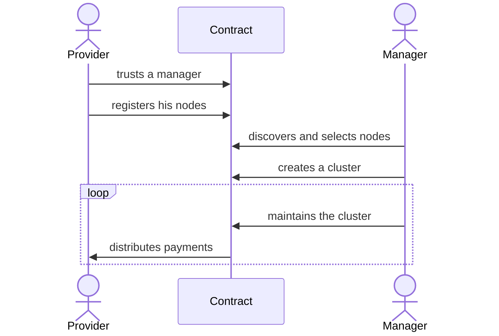
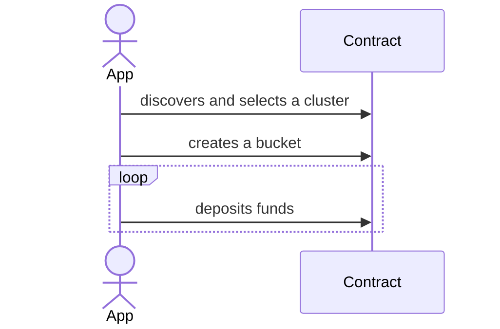
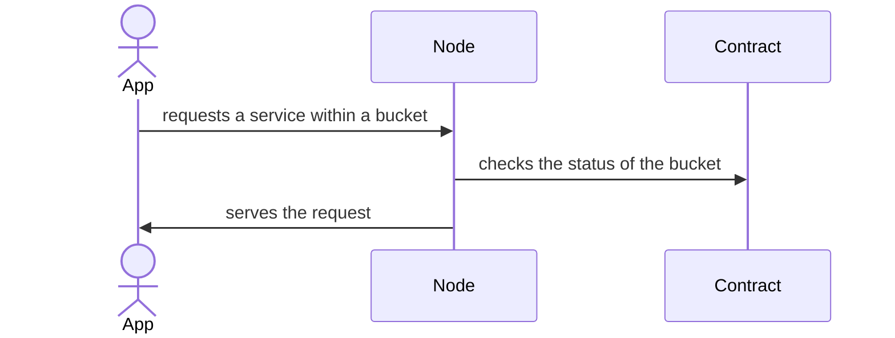
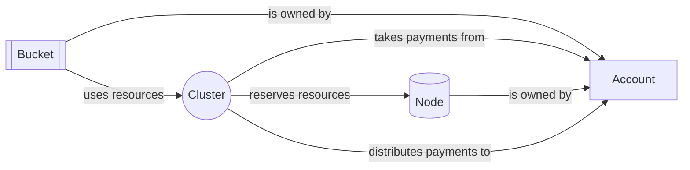
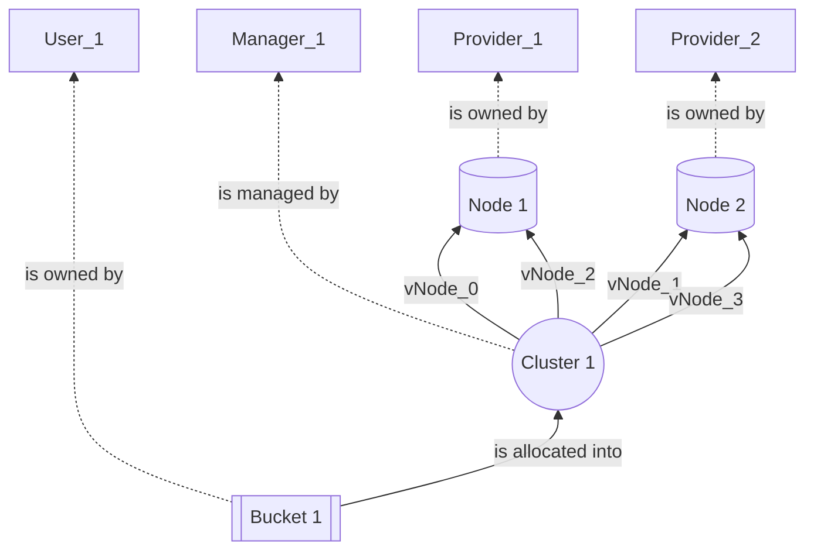

# DDC Concepts

## Problem Statement:

- Organizing a service between service providers and users.
- Make it easy for users.
- Make it flexible for app developers.
- Support access control and encryption.
- Support replication, recovery, scaling.
- Support multiple types of services.
- Validate the quality of service.
- Manage flows of payments and custody of deposits.
- Be reachable from web apps.

The functionalities are separate between DDC core and a number of DDC engines.

## DDC Core

The core of DDC is responsible for the following tasks.

- discover available services, and details to decide to what services to subscribe. E.g., engine name and version, some identity or reputation of providers.
- discover how to connect to nodes (URLs, etc) to obtain the service.
- discover the status of a user’s subscribed services, including one’s own.
- identify the owners or parties authorized to use subscribed services.
- advertise the existence of one’s provided services.
- discover the price of services.
- pay for services on a recurring basis.
- calculate due fees and verify payments.

This is achieved by a smart contracts, interfaces, and data formats.

## DDC Engines

A DDC engine does this:

- register the details of a node running the engine into the core.
- store data.
- respond to queries.
- authorize operations in the engine as specified by the subscriber.
- verify that sufficient payments were received or are expected to be received.
- collaborate with other nodes for partitioning and replication of services.
- provide a method of validation of the quality of service.
- consent to the validation process and its eventual consequences.

## DDC Core Smart Contract

### Cluster

A cluster is the main coordination point between a set of nodes and a set of users.

#### Governance of a cluster.

There are several decisions required to organize a service around a cluster:
- Which providers and which nodes are semi-trusted to provide correct services.
- Whether a node should be removed from the cluster, and which new nodes should take on its service responsibilities.
- Whether a provider actually did provide correct services and is entitled to payments.
- Whether a provider misbehaved and should be penalized or excluded.
- To update the cluster metadata if necessary.
- To change the governance scheme of the cluster.

A cluster may be managed by a trusted party using an external account, or by a smart contract. A smart-contract-as-manager may in turn take cluster-related decisions by consensus of several accounts in a multisig, by consensus of a community in a DAO or a reputation system, and by cryptonomics such as proof-of-storage based on zero-knowledge crypto, or by connecting to the nominated-proof-of-stake mechanism of the blockchain itself.

## Interactions between parties

- Providers registers Nodes.
    node_create
- Providers signal trust to a Manager.
    node_trust_manager
- Manager creates a Cluster and reserve some capacity from Nodes.
    cluster_create
    cluster_reserve_resource
- Owner creates a Bucket in a Cluster.
    bucket_create
- Owner deposits some funds.
    account_deposit
- Owner or Manager report Bucket resource usage.
    bucket_alloc_into_cluster
- Manager collects funds from Owner to the Cluster pool.
    bucket_settle_payment
- Manager distributes the funds to Providers.
    cluster_distribute_revenues

## Providers and Clusters

## Buckets and Clusters

## Nodes and Apps

## Interactions between contract components

## An example network

